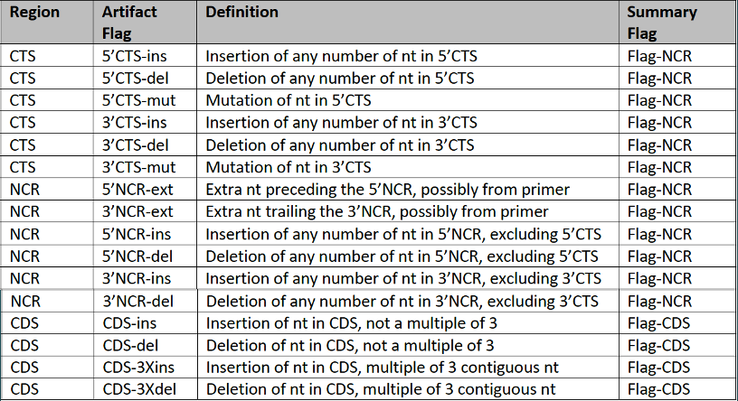

# Autocuration of Influenza Sequences and Saving Pre-Computed Alignments

This is a pipeline for curating Influenza genome sequences and designating artifact flags. The artifact
flags are meant for alerting discrepancies that have been discovered in the genome sequence and triggering
the need for correcting the sequencing.  The methods for discovering artifact flags in the sequence were
developed by JCVI/BV-BRC in collaboration with Dr. Catherine Macken at the University of Auckland.

In general, Influenza artifact flags are defined based on the following table.  These definitions very
much provide the backbone for developing the algorithms to go about curating Influenza sequences.

## Pipeline Dependencies

(1) python >=3.x is required

(2) MUSCLE v3.8.31 is required.  MUSCLE exists in this repo as an executable file and will get called when
the pipeline runs.  However, this executable has been downloaded for Mac OSX 64-bit.  To download MUSCLE 
v3.8.31 for the appropriate OS, see the downloads at https://drive5.com/muscle/downloads_v3.htm 
and follow instructions at https://drive5.com/muscle/manual/install.html.  Be sure to place the MUSCLE 
executable in the directory of this repo.

(3) All of the necessary dependencies are found in `env_setup.sh`.  To install these necessary dependencies, 
run the following in the command line:
	
	source env_setup.sh

## Running the Pipeline and Generating Outputs

After navigating to the cloned repository, the preferred way to run the pipeline is via the root directory with:

	python Autocuration.py --query [Influenza FASTA sequence(s)]

In running those commands, the pipeline will output a curation report with designated artifact flags,
if any exist.  Additionally, running the pipeline will automatically update Dr. Macken's 'Table 6',
which is a dynamically growing table bookkeeping of all past and present auto-curation flag results.
That original table is found in the `outputs` folder as `Table6_Jan2019Release.txt` but gets updated
with runs of the pipeline and left in the same folder.  However, a user can input an alternative table6
file by adjusting an optional `--table6` argument followed by a table6 file path.

Along with autocuration, a key component of this pipeline is saving a pre-computed alignment of the 
inputted query sequence.  This alignment from MUSCLE will get saved ONLY IF the sequence had no 
insertions. This pre-computed alignment is saved in `outputs` as 'ACCESSION_aligned.fasta'.

## Profile Alignments, Lookup Table, and Boundary File

The pipeline depends on the Influenza subtype-specific profile alignments for ultimately curating
the sequences, as query sequences get aligned to the profile to determine what the invalid mutations
are.  These profiles are curated alignments specific to the influenza subtype and are all found in the
`profiles` folder. Additionally, a 'lookup table' and 'boundary file' are key files used in the curation
process, the former for serving as a lookup dictionary for valid deletions and the latter marking the 
start and end locations of CTS, NCR, and CDS regions of the profile.  The profile alignments, lookup table,
and boundary file are all in the `profiles` folder.  If these need to get updated, which will very likely
be the case, they need to be kept in the same folder with the older versions removed.

## BLAST Database

A key step in this pipeline is determining the subtype of the query sequence (Species/Type/Segment), and
this is done by BLASTing all incoming query sequences against a database of all sequences making up the
profiles.  This BLAST database of profile sequences is stored in the `blast` folder, along with the BLAST
command-line executables for making a BLAST database and running the BLAST job.  This said, whenever the
profile alignments are updated, the BLAST database should be rebuilt.  Other times the BLAST database
need to be reconstructed are when new sequences are added to the `flu_profiles_db.fasta` file to make the
BLAST database more robust. Although extremely unlikely, it's possible the BLAST database will return
an uknown hit, and to accomidate for this issue, additional sequences will need to be added to the database. 

### BLAST DB Upate 1: New Profile Alignments

To recreate a BLAST database due to a new collection of profile alignments in the `profiles` folder, run
the following from the root directory:

	python build_blast_db.py

### BLAST DB Update 2: New Sequences in the Database

To make the BLAST database more comprehensive by adding additional Flu sequences, add the sequences to the
`flu_profile_db.fasta` file and then run the following within the `blast` directory:

	./makeblastdb -in flu_profiles_db.fasta -dbtype nucl

### Utilizing the BLAST Database Separately

In the case that this BLAST database needs to be used as a separate module, one can do so by importing the
BLAST object as a python library.  As long as there is a directory path to this repository, one can utilize
the BLAST database from this repo by executing the following in a python script:

	from Autocuration import Blast
	flu_strain = Blast(query.fasta).get_strain()

Here, the `Blast` object is imported and then is used to acquire the Species_Segment_Type (for example, A_4_H5)
of a query Influenza sequence stored in a FASTA file, `query.fasta`.  This Species_Segment_Type annotation is 
stored in the `flu_strain` variable which can then be used in any downstream purposes, such as Influenza metadata 
curation.

## Pipeline Performance

Disjoint sequence batches for Influenza A-D tagged with artifact flags in the FASTA metadata from the previous 
version of the Autocuration pipeline were downloaded from the legacy Influenza Research Database.  The
sequences from these four Influenza FASTA files were run against our pipeline, and the curation results were 
used to analyze precision, recall, and accuracy of our version of the Autocuration pipeline relative to the results 
from the previous pipeline.  There are several precision, recall, and accuracy metrics that need to be used to evaluate 
this pipeline, and a thorough evaluation of this pipeline's performance with each of these metrics can be viewed in 
the notebook `performance/AnalyzeAccuracy.ipynb`.

An original version of this pipeline used MAFFT instead of MUSCLE, so we include the performance results using
MAFFT in this notebook.

## Pipeline Broken Down by Modules

The pipeline can also be broken into individual scriptable modules useful as plugins. These are all
located in the `modules` folder.  Note, all of these modules are just Python classes and they are all
aggregated into one script in 'Autocuration.py'.

`main.py` - used for running all the modules as pipeline

`Curation.py` - primary module for curating sequence and updating Table 6

`InDelSubs.py` - discovers all the mutation artifact flags induced by insertions, deletions, or substitutions

`Blast.py` - used for BLASTing query sequence against profile sequence to determine subtype of the sequence

`MolSeq.py` - used for counting indeterminant nucleotides or irregular characters, computing ambiguity

